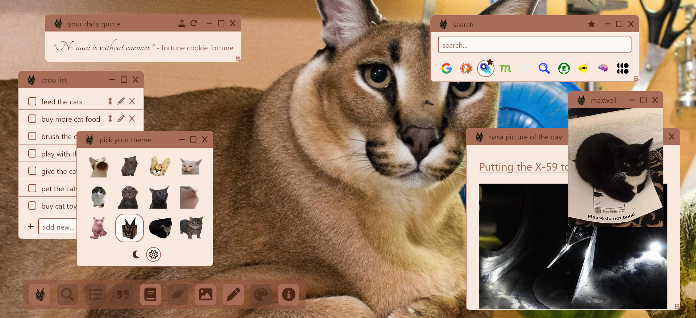

# Floppa's New Tab

A Floppa-themed widget board for your new tab



## Widgets

Click and drag a widget's title bar to move it. Click and drag the dots in the
bottom right corner of a widget to resize it. Minimize widgets by clicking the -
button, reset their size by clicking the square, or close them by clicking the
X. Closed widgets can be reopened by clicking on the icon in the taskbar.

### Search

Select a search engine, type your query, and press enter to search.

### To do List

Add new todos and check off completed ones. You can edit todos by clicking the
pencil icon. Make your changes and press enter to submit, or the escape key to
cancel. Reorder by pressing the arrows icon and then the up or down arrows on
your keyboard. Click the icon again or press enter or escape to stop moving.

Todos are stored in localStorage, so clearing cache or site data will delete
them.

### Daily todo

A separate todo list that you only see one at a time. Put your long list of
long-term low-pressure todos here, like half-finished art projects. You get only
one to focus on every day, so you're not overwhelmed by the sheer number of
possibilities. Exercise your free will safely! But if you're not feeling the one
chosen for you you can randomize another one by clicking the refresh button.
Click on the checkbox to remove the todo from the rotation.

Click on the upload button to upload a JSON with your todos. Make sure there's
no trailing comma after the last element in the array.

```
[

  "your todo here...",
  "another todo....",
  ...
]
```

These todos are also stored in localStorage. Keep your original JSON file as a
backup.

### Daily quote

A random quote every day. Click on the refresh button to get a new quote. Click
on the upload button to upload a JSON with custom quotes:

```
[
  {
    "quote": "...",
    "author": "..."
  },
  ...
]
```

Like Todos, these are stored in localStorage, so make sure to keep a backup.

### Text notes

Add any text note to your new tab with a custom title.

Also in local storage. Keep a backup.

### Images

Add nice cat images or GIFs for your new tab.

### Theme selector

Choose a cat inspired color theme for your widgets. Pick between light and dark
modes.

## Dev Setup

Windows 11, node v22.13.0, npm v10.9.2

1. `npm install --force` (there are some dependency conflicts, but everything
   seems to work okay)
2. `npm run build`
3. In Firefox, go to
   [about:debugging#/runtime/this-firefox](about:debugging#/runtime/this-firefox)
4. In the Temporary Extensions section, click on Load Temporary Add-on...
5. Select `build/manifest.json`

### Install in Firefox Nightly

You can permanently install the extension so you don't have to load it in after
every restart. This will only work in Firefox Nightly.

1. Follow steps 1 and 2 above.
2. Compress all files generated in the build folder into a .zip
3. Change the .zip extension to .xpi
4. In Firefox Nightly, go to
   [about:debugging#/runtime/this-firefox](about:debugging#/runtime/this-firefox)
5. Drag and drop your .xpi file into the temporary extensions section
6. When the confirmation popup appears, confirm installation
