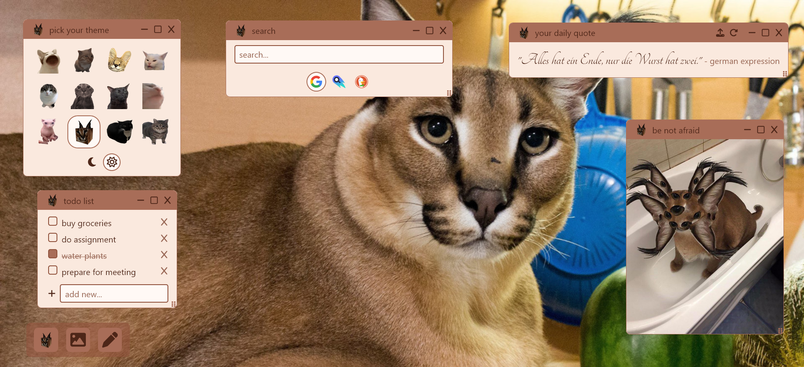

# Floppa Home

Floppa's widget board



## Widgets

Click and drag a widget's title bar to move it. Click and drag the dots in the
bottom right corner of a widget to resize it.
Minimize widgets by clicking the - button, reset their size by clicking the
square, or close them by clicking the X. Closed widgets can be reopened by
clicking on the icon in the taskbar.

### Search

Select a search engine, type your query, and press enter to search.

### To do List

Add new todos and check off completed ones. They are stored in localStorage,
so clearing cache or site data will delete them.

### Daily quote

A random quote every day. Click on the refresh button to get a new quote. Click
on the upload button to upload a JSON with custom quotes. Like Todos, these are
stored in localStorage, so make sure to keep a backup.

### Text notes

Add any text note to your new tab with a custom title.

### Images

Add nice cat images or GIFs for your new tab.

### Theme selector

Choose a cat inspired color theme for your widgets. Pick between light and dark
modes.

## Setup

Hosted on render [here](https://widget-board.onrender.com/).

Set Firefox's default homepage on new windows to https://widget-board.onrender.com/ and use [this extension](https://addons.mozilla.org/en-US/firefox/addon/new-tab-homepage/) to make it the default new tab too.

## Expanding the ESLint configuration

If you are developing a production application, we recommend updating the configuration to enable type aware lint rules:

- Configure the top-level `parserOptions` property like this:

```js
export default tseslint.config({
  languageOptions: {
    // other options...
    parserOptions: {
      project: ["./tsconfig.node.json", "./tsconfig.app.json"],
      tsconfigRootDir: import.meta.dirname,
    },
  },
});
```

- Replace `tseslint.configs.recommended` to `tseslint.configs.recommendedTypeChecked` or `tseslint.configs.strictTypeChecked`
- Optionally add `...tseslint.configs.stylisticTypeChecked`
- Install [eslint-plugin-react](https://github.com/jsx-eslint/eslint-plugin-react) and update the config:

```js
// eslint.config.js
import react from "eslint-plugin-react";

export default tseslint.config({
  // Set the react version
  settings: { react: { version: "18.3" } },
  plugins: {
    // Add the react plugin
    react,
  },
  rules: {
    // other rules...
    // Enable its recommended rules
    ...react.configs.recommended.rules,
    ...react.configs["jsx-runtime"].rules,
  },
});
```
